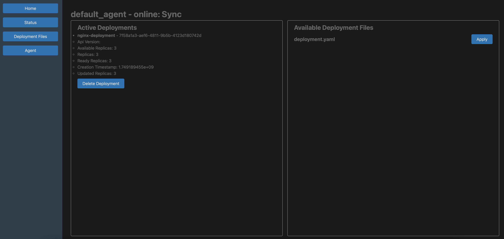

# go-k8s-cord
A poor attempt to do coordination between k8s clusters(In Progress). 



# Setup
Central requires etcd running at `localhost:2379`. See more details after config files are generated.
Setup some ci/cd pipeline to have the deployment repository synced across all agents and 
central(because central checks git hash to determine if deployment files are up to date).
Then fill in the relevant fields in the config files on both central and agent controllers.

## Availability
Make sure central and agent can reach each other with url.

## Certificates
### With justfile
```bash
just gen-ca
just gen-central
just gen-agent
just gen-grpc
```
### Without justfile
Well, you can just copy the commands from the justfile and run them manually.

## Config
On the first run, agent controller will generate a config file `agent.yaml` and 
exit immediately, because it needs to know the central controller address.
Fill it in before restarting(for local testing, using `localhost` is sufficient). 

`registered` and `uuid` fields are generated automatically, so you can leave them empty.
Because of `viper`, you can also change the agent name during runtime. It will be reflected 
in the central controller after the next heartbeat.

## Serving
```bash
go run ./cmd/central serve # start central controller
go run ./cmd/agent serve # start agent controller
```

# Code Overview
## Communication:
### Central - Agent:
Uses grpc to communicate between central and remote agents. 
Central have a single grpc server and multiple grpc clients, 
one for each remote agent.
Agents each have a grpc server and a grpc client to 
communicate with the central agent.

Agent sends heartbeats regularly to the central agent to prove 
liveness. 

### Local Access(cli & web interface):
Central spins up a http server, handles both api endpoints and 
html serving. html actions just call the localhost api endpoints(you 
are not supposed to use the html interface on other machines).

## Routes Understanding:
This is primarily for the *central controller*, because agent controllers are 
not supposed to be accessed directly, they perform actions in grpc calls.

Right now, the api endpoints look like this:
```
/api/v1/xxx/yyy/dosomething
```
The page serving endpoints look like this:
```
/xxx/yyy/dosomething
```
And the latter often depends on the former to perform actions.

## Web Interface:
I have no idea what I am doing, so the web interface is a mess. Uses 
htmx to perform actions.

# Interaction
## Central
```bash
go run ./cmd/central status
```

## Agent
```bash
go run ./cmd/agent status
go run ./cmd/agent pods
```

# todo list
- [ ] match cli capability with ui
- [ ] helm support
- [ ] k8s nodes
- [X] k8s pods
- [X] k8s deployments
- [ ] k8s services
